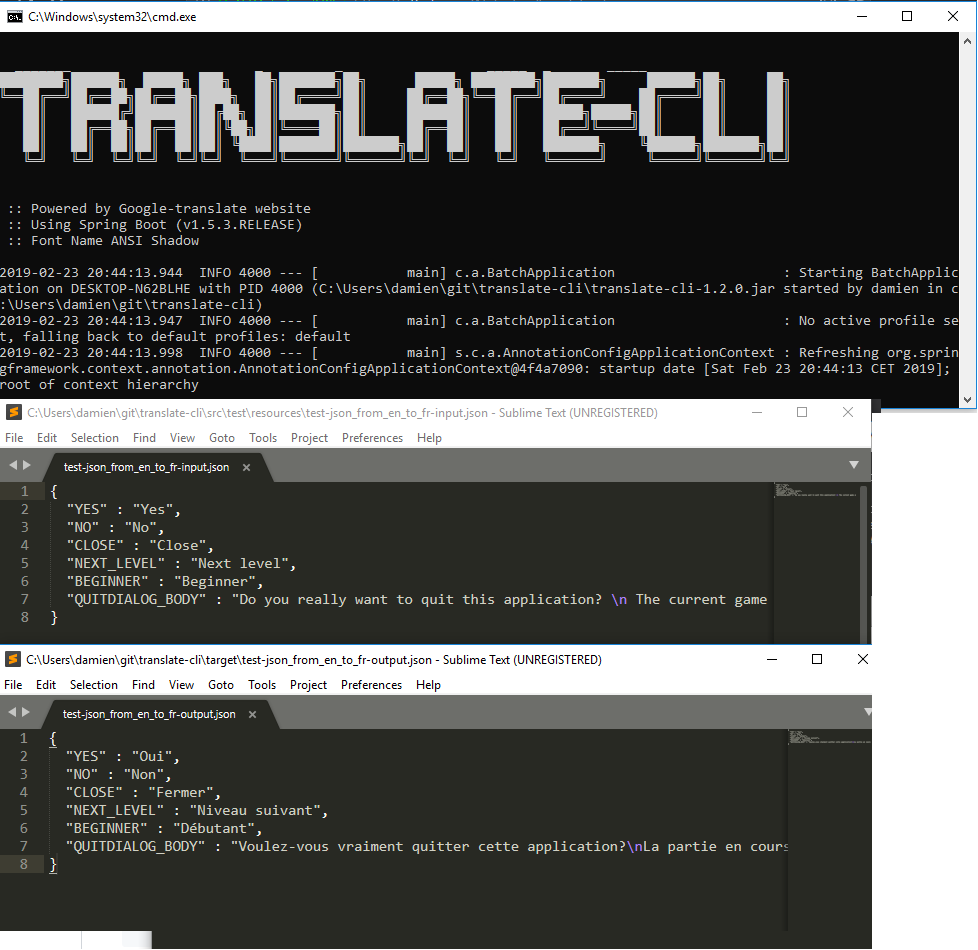

# TRANSLATE-CLI

Automatic translation tool.



## Features

- JSON files (file to file, key, value)
- text files (file to file, lines by line)


## Getting started

- run on windows
- install Java
- git pull this repo
- go in this repo's folder
- test it with `java -jar translate-cli-1.3.0.jar --input=./input/test/resources/test-text_from_en_to_fr-input.txt --output=./test-text_from_en_to_fr-output.txt --input-lang=en --output-lang=fr`

## Syntax

```
java -jar translate-cli-1.0.1.jar
       [--mode=<ModeTextOrJson>]
       [--input=<FilePath>]
       [--input-lang=<LangLocale>]
       [--output=<FilePath>]
       [--output-lang=<Langlocale>]
```

## Command Parameters

```
java -jar translate-cli-1.0.1.jar [ parameters ]
```

| Parameters and argument specifications | Description      |
|----------------------------------------|------------------|
| `--mode` *mode*                     | translation type *json* *text*   |
| `--input` *FilePath*                |                 |
| `--input-lang` *LangLocale*        |                  |
| `--output` *FilePath*               |                  |
| `--output-lang` *LangLocale*       |                   |

## Examples

launch command then autorize PhantomJS execution

Execute for text files (file to file, lines by line)

```
java -jar translate-cli-1.3.0.jar --input=./input/test/resources/test-text_from_en_to_fr-input.txt --output=./test-text_from_en_to_fr-output.txt --input-lang=en --output-lang=fr
```

Execute for JSON files (file to file, key, value)

```
java -jar translate-cli-1.3.0.jar --input=./input/test/resources/test-json_from_en_to_fr-input.json --output=./test-json_from_en_to_fr-output.json --input-lang=en --output-lang=fr
```

Store script for your project

```
# translate-googleplay.bat

cd "c:\Users\damien\git\translate-cli"

set MYFILE="c:\Users\damien\git\project-2048\Project 2048 Cars-googleplay\locale"
set MYVERSION=1.3.0

set MYLANG=fr
java -jar translate-cli-%MYVERSION%.jar --mode=html2text --input=%MYFILE%.txt --input-lang=en --output=%MYFILE%-%MYLANG%.txt --output-lang=%MYLANG%
set MYLANG=en
java -jar translate-cli-%MYVERSION%.jar --mode=html2text --input=%MYFILE%.txt --input-lang=en --output=%MYFILE%-%MYLANG%.txt --output-lang=%MYLANG%
set MYLANG=ja
java -jar translate-cli-%MYVERSION%.jar --mode=html2text --input=%MYFILE%.txt --input-lang=en --output=%MYFILE%-%MYLANG%.txt --output-lang=%MYLANG%
set MYLANG=ko
java -jar translate-cli-%MYVERSION%.jar --mode=html2text --input=%MYFILE%.txt --input-lang=en --output=%MYFILE%-%MYLANG%.txt --output-lang=%MYLANG%
set MYLANG=zh-TW
java -jar translate-cli-%MYVERSION%.jar --mode=html2text --input=%MYFILE%.txt --input-lang=en --output=%MYFILE%-%MYLANG%.txt --output-lang=%MYLANG%
set MYLANG=de
java -jar translate-cli-%MYVERSION%.jar --mode=html2text --input=%MYFILE%.txt --input-lang=en --output=%MYFILE%-%MYLANG%.txt --output-lang=%MYLANG%
set MYLANG=pt
java -jar translate-cli-%MYVERSION%.jar --mode=html2text --input=%MYFILE%.txt --input-lang=en --output=%MYFILE%-%MYLANG%.txt --output-lang=%MYLANG%
set MYLANG=es
java -jar translate-cli-%MYVERSION%.jar --mode=html2text --input=%MYFILE%.txt --input-lang=en --output=%MYFILE%-%MYLANG%.txt --output-lang=%MYLANG%
set MYLANG=it
java -jar translate-cli-%MYVERSION%.jar --mode=html2text --input=%MYFILE%.txt --input-lang=en --output=%MYFILE%-%MYLANG%.txt --output-lang=%MYLANG%
set MYLANG=ru
java -jar translate-cli-%MYVERSION%.jar --mode=html2text --input=%MYFILE%.txt --input-lang=en --output=%MYFILE%-%MYLANG%.txt --output-lang=%MYLANG%
set MYLANG=hi
java -jar translate-cli-%MYVERSION%.jar --mode=html2text --input=%MYFILE%.txt --input-lang=en --output=%MYFILE%-%MYLANG%.txt --output-lang=%MYLANG%
```

Resources script for your project

```
# translate-locale.bat

cd "c:\Users\damien\git\translate-cli"

set MYFILE="c:\Users\damien\git\project-2048\Project 2048\Assets\Project 2048\Resources\i18n\locale"
set MYVERSION=1.3.0

set MYLANG=fr
java -jar translate-cli-%MYVERSION%.jar --mode=json --input=%MYFILE%-en.json --input-lang=en --output=%MYFILE%-%MYLANG%.json --output-lang=%MYLANG%
set MYLANG=ja
java -jar translate-cli-%MYVERSION%.jar --mode=json --input=%MYFILE%-en.json --input-lang=en --output=%MYFILE%-%MYLANG%.json --output-lang=%MYLANG%
set MYLANG=ko
java -jar translate-cli-%MYVERSION%.jar --mode=json --input=%MYFILE%-en.json --input-lang=en --output=%MYFILE%-%MYLANG%.json --output-lang=%MYLANG%
set MYLANG=zh-TW
java -jar translate-cli-%MYVERSION%.jar --mode=json --input=%MYFILE%-en.json --input-lang=en --output=%MYFILE%-%MYLANG%.json --output-lang=%MYLANG%
set MYLANG=de
java -jar translate-cli-%MYVERSION%.jar --mode=json --input=%MYFILE%-en.json --input-lang=en --output=%MYFILE%-%MYLANG%.json --output-lang=%MYLANG%
set MYLANG=pt
java -jar translate-cli-%MYVERSION%.jar --mode=json --input=%MYFILE%-en.json --input-lang=en --output=%MYFILE%-%MYLANG%.json --output-lang=%MYLANG%
set MYLANG=es
java -jar translate-cli-%MYVERSION%.jar --mode=json --input=%MYFILE%-en.json --input-lang=en --output=%MYFILE%-%MYLANG%.json --output-lang=%MYLANG%
set MYLANG=it
java -jar translate-cli-%MYVERSION%.jar --mode=json --input=%MYFILE%-en.json --input-lang=en --output=%MYFILE%-%MYLANG%.json --output-lang=%MYLANG%
set MYLANG=ru
java -jar translate-cli-%MYVERSION%.jar --mode=json --input=%MYFILE%-en.json --input-lang=en --output=%MYFILE%-%MYLANG%.json --output-lang=%MYLANG%
set MYLANG=hi
java -jar translate-cli-%MYVERSION%.jar --mode=json --input=%MYFILE%-en.json --input-lang=en --output=%MYFILE%-%MYLANG%.json --output-lang=%MYLANG%
```

## Roadmap

- Basic (terminal)
